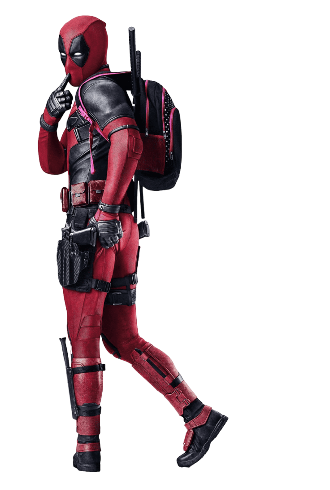
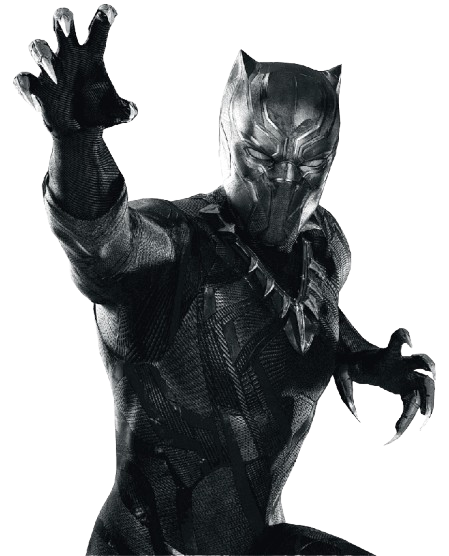
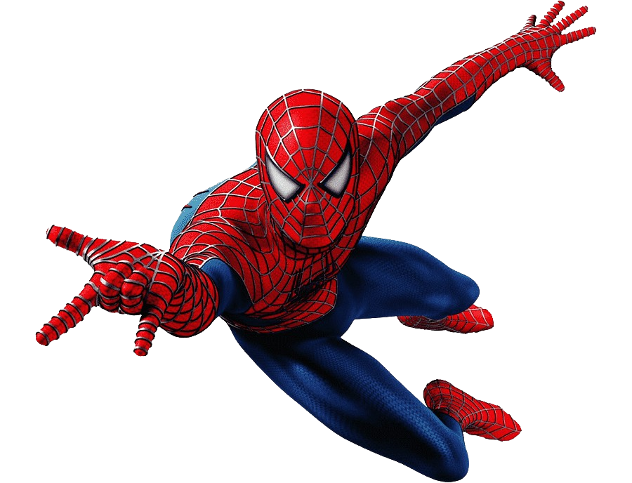
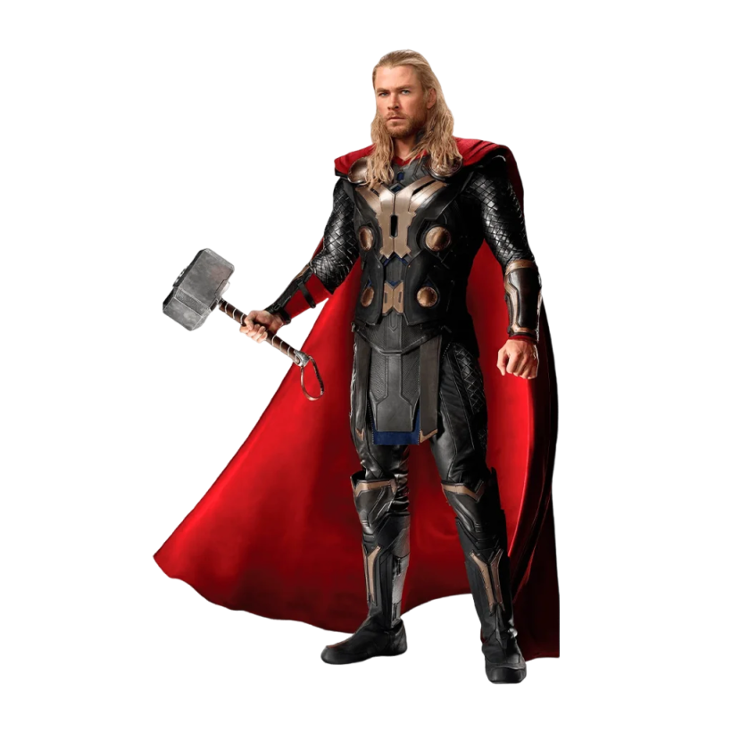

# Site Vertical

.png)

## Sobre

Site do tipo Vertical para divulgar alguns super-heróis. O objetivo desse  projeto é colocar em prática os conhecimentos adquiridos sobre linguagem de marcação, durante o curso de desenvolvimento de sistemas do [SENAI Jandira] https://sp.senai.br/unidade/jandira/

---
## Tecnologias utilizadas

- HTML
- CSS
- MarkDown
- Git

---

## Autor

- [Daniel Torres](https://www.linkedin.com/in/daniel-torres-007a54217/)